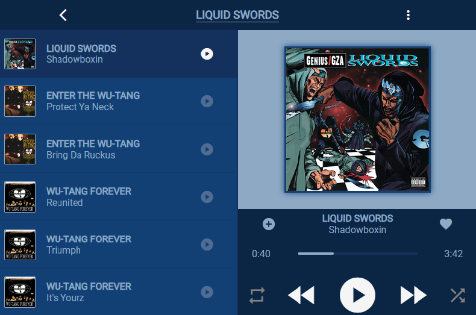

# Music Player HTML Template

This HTML file contains a simple music player interface showcasing songs using HTML, CSS, and Material Icons. The layout includes a list of songs with album covers, song titles, and album names.

## Usage

This HTML template demonstrates a basic structure for a music player interface. It includes a main container with a header bar displaying song information, a list of songs with album covers and titles, and a section on the right displaying additional song information, an album cover, progress bar, and control buttons.

## Preview

## Getting Started

To use this HTML template:

1. Clone or download the repository.
2. Open the HTML file in your preferred code editor.
3. Modify the content, styles, or structure as needed for your project.

## Technologies Used

- HTML
- CSS
- Material Icons
- Google Fonts (Roboto)
